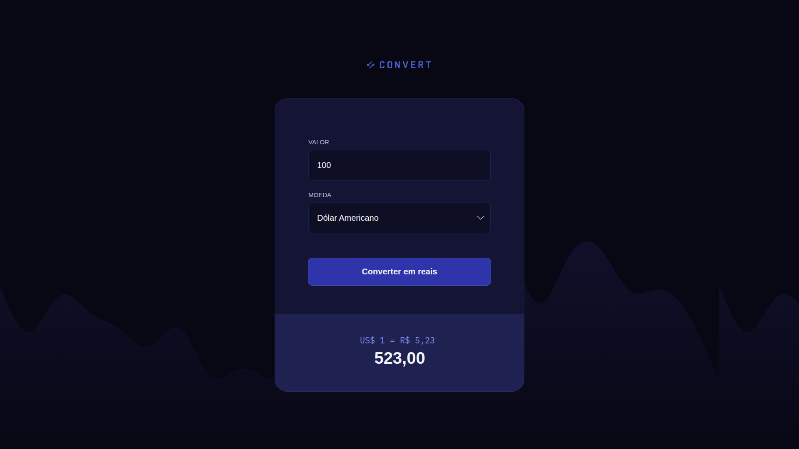

# 💱 Convert - Conversor de Moedas

Este é um projeto simples de **conversor de moedas** desenvolvido com **HTML**, **CSS** e **JavaScript**. Ele permite que o usuário insira um valor em moeda estrangeira (USD, EUR ou GBP) e converta para o valor equivalente em **Reais (BRL)**.

## 📸 Preview



## 🚀 Funcionalidades

- Conversão de:
  - Dólar Americano (USD)
  - Euro (EUR)
  - Libra Esterlina (GBP)
- Atualização automática das cotações com API externa
- Validação de entrada numérica
- Design responsivo e moderno

## 🛠 Tecnologias Utilizadas

- HTML5
- CSS3
- JavaScript (ES6+)
- [AwesomeAPI](https://docs.awesomeapi.com.br/api-de-moedas) para obter as cotações (não usei nesse projeto mas pode ser usado)

## 📂 Estrutura de Pastas

```
convert-template-main/
│
├── index.html             # Página principal
├── styles.css             # Estilos do projeto
├── scripts.js             # Lógica de conversão em JS
├── /img/                  # Imagens usadas no projeto
│   └── logo.svg
```

## ▶️ Como Executar

1. Clone o repositório:
   ```bash
   git clone https://github.com/seu-usuario/convert-moeda.git
   ```

2. Acesse a pasta do projeto:
   ```bash
   cd convert-moeda
   ```

3. Abra o arquivo `index.html` no seu navegador:
   - Você pode abrir diretamente ou usar uma extensão como o **Live Server** do VSCode.

---

## 🧠 Aprendizados

Este projeto foi uma excelente forma de praticar:
- Manipulação do DOM com JavaScript
- Requisições assíncronas com `fetch()`
- Formatação de valores numéricos
- Design UI moderno com HTML e CSS

## 📌 TODO

- [ ] Adicionar mais moedas
- [ ] Suporte a conversão de BRL para outras moedas
- [ ] Internacionalização (i18n)

## 📄 Licença

Este projeto está sob a licença MIT. Sinta-se livre para usar, modificar e compartilhar!

---

> Feito com 💙 por [github.com/charlesthomaz]
